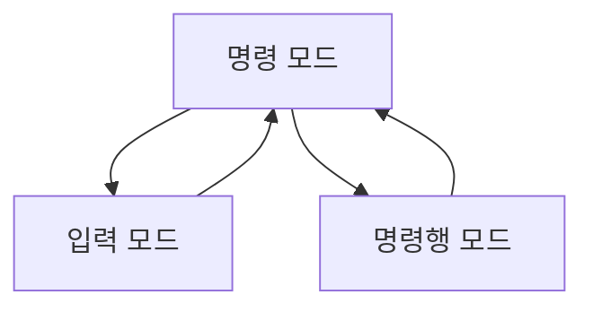

### 리눅스 **vi 텍스트 에디터 사용법**


`vi`는 리눅스와 유닉스 시스템에서 기본 제공되는 강력한 텍스트 에디터입니다. 다소 직관적이지 않지만, 기본적인 사용법만 익히면 효율적인 파일 편집이 가능합니다.

---

### vi의 3가지 모드

`vi`는 3가지 주요 모드로 동작합니다.

| **모드** | **설명** |
| --- | --- |
| **명령 모드 (Command mode)** | 기본 모드로, 커서 이동, 명령 실행(저장, 종료 등)을 수행합니다. |
| **입력 모드 (Insert mode)** | 텍스트를 입력할 수 있는 모드로, 키보드로 직접 내용을 작성합니다. |
| **명령행 모드 (Command-line mode)** | 명령 모드에서 `:` 키를 눌러 실행하며, 파일 저장, 종료, 검색 등 고급 명령을 수행합니다. |

---

### vi 실행 및 종료

1. **파일 열기**:
    
    ```bash
    vi 파일이름
    
    ```
    
    - 파일이 존재하지 않으면 새 파일이 생성됩니다.
2. **종료 및 저장**:
    - 저장 후 종료: `:wq`
    - 저장 없이 종료: `:q!`
    - 파일 저장: `:w`

---

### 기본 작업

### 1. **모드 전환**

- **명령 모드 → 입력 모드**: `i`, `a`, `o` 중 하나를 사용
    - `i`: 현재 커서 위치에서 입력
    - `a`: 커서 다음 위치에서 입력
    - `o`: 새로운 줄에서 입력
- **입력 모드 → 명령 모드**: `Esc` 키를 누름
- **명령 모드 → 명령행 모드**: `:` 입력

### 2. **텍스트 이동**

| **명령어** | **설명** |
| --- | --- |
| `h` | 왼쪽으로 이동 |
| `l` | 오른쪽으로 이동 |
| `j` | 아래로 이동 |
| `k` | 위로 이동 |
| `Ctrl + d` | 화면의 절반 아래로 스크롤 |
| `Ctrl + u` | 화면의 절반 위로 스크롤 |
| `G` | 파일 끝으로 이동 |
| `gg` | 파일 처음으로 이동 |

### 3. **텍스트 삭제**

| **명령어** | **설명** |
| --- | --- |
| `x` | 커서 위치의 문자 삭제 |
| `dd` | 현재 줄 삭제 |
| `d$` | 커서부터 줄 끝까지 삭제 |
| `d^` | 줄 시작부터 커서까지 삭제 |

### 4. **텍스트 복사 및 붙여넣기**

| **명령어** | **설명** |
| --- | --- |
| `yy` | 현재 줄 복사 |
| `y$` | 커서부터 줄 끝까지 복사 |
| `p` | 커서 아래에 붙여넣기 |
| `P` | 커서 위에 붙여넣기 |

### 5. **텍스트 검색**

- **검색**: `/문자열` (아래 방향 검색) 또는 `?문자열` (위 방향 검색)
- **다음 검색 결과로 이동**: `n`
- **이전 검색 결과로 이동**: `N`

### 6. **취소/복구**

| **명령어** | **설명** |
| --- | --- |
| `u` | 마지막 명령 취소 |
| `Ctrl + r` | 취소한 명령 복구 |

---

### 고급 기능

### 1. **특정 줄 이동**

- 특정 줄로 이동: `:숫자`
예: `:10` → 10번째 줄로 이동.

### 2. **단어 단위 이동**

| **명령어** | **설명** |
| --- | --- |
| `w` | 다음 단어로 이동 |
| `b` | 이전 단어로 이동 |
| `e` | 현재 단어의 끝으로 이동 |

### 3. **라인 수정**

| **명령어** | **설명** |
| --- | --- |
| `cc` | 현재 줄 내용을 삭제하고 입력 모드로 전환 |
| `C` | 커서 이후 줄 끝까지 삭제하고 입력 모드로 전환 |

### 4. **여러 파일 편집**

- 여러 파일 열기: `vi 파일1 파일2`
- 다음 파일로 이동: `:n`
- 이전 파일로 이동: `:N`

---

### 시각적 이해: vi 모드 전환 흐름



---

## vi 에디터 추가 기능 및 활용법

---

### 1. **다중 줄 편집**

vi에서는 여러 줄을 한 번에 편집할 수 있습니다.

### 여러 줄 삭제

- **명령어**: `숫자dd`
- **예시**: `5dd` → 현재 줄부터 5줄 삭제.

### 여러 줄 복사

- **명령어**: `숫자yy`
- **예시**: `3yy` → 현재 줄부터 3줄 복사.

### 여러 줄 붙여넣기

- **명령어**: `p` 또는 `P` (복사한 내용 붙여넣기).

### 비주얼 모드 사용

- **명령어**: `v`
    - 커서를 드래그하듯 선택.
    - 선택 후 명령 실행 가능 (`d`로 삭제, `y`로 복사 등).
- **라인 선택**: `V` (전체 줄 선택).
- **블록 선택**: `Ctrl + v` (직사각형 블록 선택).

---

### 2. **문자열 치환**

### 현재 줄에서 문자열 치환

- **명령어**: `:s/기존문자열/새문자열/`
- **예시**: `:s/old/new/` → 현재 줄의 `old`를 `new`로 바꿈.

### 전체 파일에서 문자열 치환

- **명령어**: `:%s/기존문자열/새문자열/g`
- **예시**: `:%s/error/fixed/g` → 전체 파일에서 `error`를 `fixed`로 바꿈.

### 대소문자 구분 없이 치환

- **명령어**: `:%s/기존문자열/새문자열/gi`
- **예시**: `:%s/hello/Hi/gi` → `hello` 또는 `Hello`를 `Hi`로 변경.

---

### 3. **여러 파일 간 작업**

### 여러 파일 동시에 열기

- **명령어**: `vi 파일1 파일2 ...`
- **파일 목록 확인**: `:args`

### 파일 간 전환

- 다음 파일로 이동: `:n`
- 이전 파일로 이동: `:N`

### 현재 파일 저장 후 다음 파일로 이동

- **명령어**: `:wn`

---

### 4. **탭 기능**

### 탭 활성화

vi 자체는 탭을 기본적으로 지원하지 않지만, vim에서는 탭 기능을 제공합니다.

- 새 탭 열기: `:tabnew 파일이름`
- 탭 간 전환: `gt` (다음 탭), `gT` (이전 탭).
- 탭 목록 보기: `:tabs`

---

### 5. **검색 및 탐색 고급 사용법**

### 검색 강조

- 검색한 문자열이 강조 표시되도록 설정:
    - 명령어: `:set hlsearch`
    - 비활성화: `:set nohlsearch`

### 특정 줄 검색

- 특정 문자열이 포함된 줄로 이동:
    - 명령어: `/문자열`

### 줄 번호 표시

- **줄 번호 활성화**: `:set number` 또는 `:set nu`
- **줄 번호 비활성화**: `:set nonumber` 또는 `:set nonu`

---

### 6. **vi 설정 최적화**

### 설정 파일 수정

vi는 개인 설정 파일을 통해 동작을 최적화할 수 있습니다.

- 설정 파일 위치: `~/.vimrc` (vim의 경우).
- 자주 사용하는 설정 추가 예시:
    
    ```
    set number          " 줄 번호 표시
    set tabstop=4       " 탭 크기 설정
    set expandtab       " 탭을 공백으로 변환
    set hlsearch        " 검색 결과 강조
    set ignorecase      " 검색 시 대소문자 구분하지 않음
    
    ```
    

---

### 7. **외부 명령과 연동**

vi에서 외부 명령을 실행하여 작업을 자동화할 수 있습니다.

### 외부 명령 실행

- **명령어**: `:!명령`
- **예시**: `:!ls` → 현재 디렉토리 파일 목록 표시.

### vi에서 파일 내용 바로 삽입

- **명령어**: `:r 파일이름`
- **예시**: `:r /etc/hosts` → `/etc/hosts` 파일의 내용을 현재 위치에 삽입.

---

### 8. **매크로 사용**

vi는 반복적인 작업을 매크로로 저장하고 재사용할 수 있습니다.

### 매크로 기록

1. 매크로 기록 시작: `q레지스터`
    - **예시**: `qa` → 레지스터 `a`에 기록 시작.
2. 작업 수행: 명령 실행.
3. 기록 종료: `q`.

### 매크로 실행

- **명령어**: `@레지스터`
- **예시**: `@a` → 레지스터 `a`의 매크로 실행.

### 매크로 반복 실행

- **명령어**: `숫자@레지스터`
- **예시**: `5@a` → 레지스터 `a`의 매크로를 5번 실행.

---

### 9. **다양한 확장 도구**

vim에서는 vi 기능을 확장하여 더 강력한 텍스트 편집을 지원합니다.

- **플러그인 관리**: vim 플러그인(`Vundle`, `Pathogen`)을 사용하여 코드 자동 완성, 파일 탐색 등 추가 기능 설치 가능.
- **예시 플러그인**: `NERDTree` (파일 탐색기), `CtrlP` (파일 검색기).

---

### 비유

vi 에디터를 **종이 공예 도구**에 비유하면 다음과 같습니다:

1. **명령 모드**: 도면을 작성하거나 잘라낼 부분을 계획하는 단계.
2. **입력 모드**: 종이를 실제로 자르고 붙이는 단계.
3. **명령행 모드**: 작업물을 저장하거나 수정 사항을 확정하는 단계.