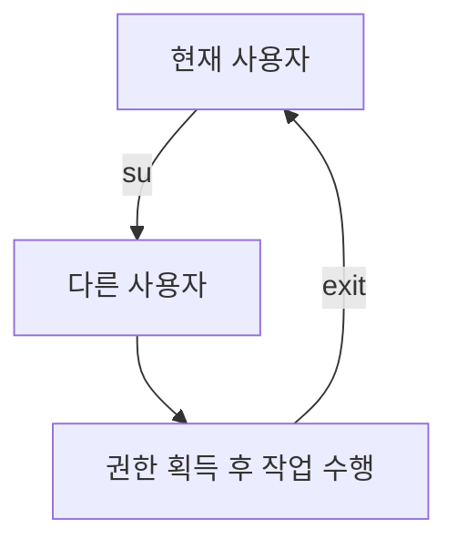

### **리눅스 `sudo` 명령어**

`sudo`는 "superuser do"의 약자로, 일반 사용자가 관리자 권한(루트 권한)으로 특정 명령을 실행할 수 있도록 허용하는 리눅스 명령어입니다. `sudo`는 보안과 효율성을 높이기 위해 설계되었으며, 관리자 비밀번호 대신 **현재 사용자 비밀번호**를 입력하여 실행합니다.

---

### **`sudo`의 주요 특징**

1. **권한 제한**: 특정 명령만 관리자 권한으로 실행 가능.
2. **안전성**: 관리자 비밀번호를 노출하지 않고, 로그로 모든 실행 기록을 저장.
3. **시간 제한**: 인증 후 기본적으로 5분간 추가 인증 없이 사용 가능(설정 변경 가능).
4. **로그 기록**: 실행한 명령은 `/var/log/auth.log` 또는 `/var/log/secure`에 기록.

---

### **`sudo`의 기본 사용법**

1. **명령어 실행**:
    
    ```bash
    sudo 명령어
    
    ```
    
    - **예시**: 시스템 업데이트:
        
        ```bash
        sudo apt update
        
        ```
        
2. **특정 사용자 권한으로 실행**:
    
    ```bash
    sudo -u 사용자이름 명령어
    
    ```
    
    - **예시**: `hong` 사용자로 `ls` 명령 실행:
        
        ```bash
        sudo -u hong ls /home/hong
        
        ```
        
3. **루트 사용자 권한으로 셸 실행**:
    
    ```bash
    sudo -i
    
    ```
    
    - 관리자 권한으로 셸에 접근.
4. **환경 변수 유지**:
    
    ```bash
    sudo -E 명령어
    
    ```
    
    - 현재 사용자의 환경 변수를 유지하면서 명령 실행.

---

### **`sudo`의 주요 옵션**

| **옵션** | **설명** |
| --- | --- |
| `-u` | 특정 사용자로 명령 실행. 기본값은 `root`. |
| `-i` | 로그인 셸로 전환(루트 계정의 환경 변수 적용). |
| `-E` | 현재 사용자의 환경 변수 유지. |
| `-k` | 인증 기록 삭제(다시 비밀번호 입력 요구). |
| `-b` | 명령을 백그라운드에서 실행. |
| `-l` | 현재 사용자가 실행 가능한 명령 목록 출력. |
| `--help` | `sudo` 명령의 도움말 출력. |

### **예시**

1. **현재 사용자가 실행 가능한 명령 확인**:
    
    ```bash
    sudo -l
    
    ```
    
2. **명령을 백그라운드에서 실행**:
    
    ```bash
    sudo -b 명령어
    
    ```
    
    - **예시**:
        
        ```bash
        sudo -b apt upgrade
        
        ```
        

---

### **`sudo`와 관련된 설정: sudoers 파일**

### 1. **sudoers 파일 개요**

- `/etc/sudoers` 파일은 `sudo` 명령의 권한과 동작 방식을 정의합니다.
- 수정을 위해 반드시 `visudo` 명령을 사용해야 합니다:
    
    ```bash
    sudo visudo
    
    ```
    
    - `visudo`는 문법 오류를 방지합니다.

### 2. **sudoers 파일 기본 구조**

```
사용자  ALL=(ALL:ALL) 명령

```

- **구성 요소**:
    - **사용자**: `sudo` 권한을 부여할 사용자 이름.
    - **ALL**: 모든 호스트에서 적용.
    - `(ALL:ALL)`: 실행 사용자 및 그룹(기본값: 모든 사용자 및 그룹).
    - **명령**: 허용된 명령(생략 시 모든 명령 가능).

### 3. **예시**

1. 모든 명령 허용:
    
    ```
    hong  ALL=(ALL:ALL) ALL
    
    ```
    
2. 특정 명령만 허용:
    
    ```
    hong  ALL=(ALL) /bin/systemctl
    
    ```
    
    - 사용자 `hong`은 `systemctl` 명령만 실행 가능.
3. 비밀번호 없이 실행:
    
    ```
    hong  ALL=(ALL:ALL) NOPASSWD: ALL
    
    ```
    

---

### **`sudo`를 사용한 고급 설정**

### 1. **그룹 기반 `sudo` 권한 설정**

- 그룹에 속한 모든 사용자에게 `sudo` 권한 부여:
    
    ```
    %admin ALL=(ALL:ALL) ALL
    
    ```
    
    - 그룹 이름 앞에 `%`를 붙여 지정.
    - **예시**: `admin` 그룹의 모든 사용자가 `sudo` 사용 가능.

### 2. **로그 확인**

- `sudo` 실행 기록은 `/var/log/auth.log`에 저장됩니다.
    - **로그 확인**:
        
        ```bash
        sudo cat /var/log/auth.log | grep 'sudo'
        
        ```
        

### 3. **시간 제한 변경**

- 기본 인증 시간은 5분입니다. 이를 변경하려면 `/etc/sudoers`에 설정 추가:
    
    ```
    Defaults timestamp_timeout=10
    
    ```
    
    - 10분으로 변경.
    - `1`로 설정하면 인증 시간이 무제한.

---

### **`sudo` 사용 사례**

1. **파일 복사**:
    - 루트 권한이 필요한 디렉토리에 파일 복사:
        
        ```bash
        sudo cp myfile /etc/myconfig/
        
        ```
        
2. **패키지 설치**:
    - 관리자 권한으로 소프트웨어 설치:
        
        ```bash
        sudo apt install vim
        
        ```
        
3. **서비스 관리**:
    - 특정 서비스 시작:
        
        ```bash
        sudo systemctl start apache2
        
        ```
        
4. **사용자 계정 관리**:
    - 새 사용자 추가:
        
        ```bash
        sudo useradd -m -s /bin/bash newuser
        
        ```
        

---

---

### **보안 관련 팁**

1. **최소 권한 원칙**:
    - 필요 최소한의 명령만 `sudo` 권한으로 허용.
    - `/etc/sudoers`에서 특정 명령만 허용하도록 설정.
2. **비밀번호 없이 실행 금지**:
    - 보안을 위해 모든 사용자는 비밀번호를 입력하도록 설정.
3. **로그 모니터링**:
    - `/var/log/auth.log`를 주기적으로 확인하여 비정상적인 `sudo` 사용을 탐지.
4. **제한된 사용자를 위한 그룹 설정**:
    - `sudo` 권한이 필요한 사용자만 그룹에 추가하여 관리.

---

### **리눅스 `su` 명령어**

`su`는 **substitute user** 또는 **switch user**의 약자로, **다른 사용자로 전환**하거나 **권한을 임시로 얻기 위한 명령어**입니다. 주로 관리자(root) 계정으로 전환하거나 특정 사용자 권한으로 작업을 수행할 때 사용됩니다.

---

### **`su` 명령어의 기본 사용법**

1. **사용자 전환**
    
    ```bash
    su [사용자이름]
    
    ```
    
    - 사용자의 비밀번호를 입력하면 해당 사용자로 전환됩니다.
    - **예시**: `su hong`
    → `hong` 사용자로 전환.
2. **루트 계정으로 전환**
    
    ```bash
    su
    
    ```
    
    - 기본적으로 `su` 명령은 `root` 계정으로 전환합니다.
    - 관리자 권한으로 시스템 작업을 수행할 때 사용.
3. **다른 사용자로 전환하며 환경 설정 유지**
    
    ```bash
    su - [사용자이름]
    
    ```
    
    - 하이픈(``) 옵션을 사용하면 전환된 사용자의 환경 변수, 경로, 셸 설정 등이 적용됩니다.
    - **예시**: `su - hong`
    → `hong` 사용자의 홈 디렉토리와 환경 변수를 적용.

---

### **`su` 명령어의 주요 옵션**

| **옵션** | **설명** |
| --- | --- |
| `-` | 전환된 사용자의 환경 변수와 홈 디렉토리로 변경. |
| `-l` | `-`와 동일(로그인 셸로 전환). |
| `-c` | 특정 명령을 실행 후 즉시 로그아웃. |
| `--help` | `su` 명령의 도움말 출력. |

### **예시**

1. 특정 명령 실행 후 종료:
    
    ```bash
    su -c "ls /root" root
    
    ```
    
    → `root` 사용자 권한으로 `/root` 디렉토리의 파일 목록 출력.
    
2. 특정 셸 실행:
    
    ```bash
    su -s /bin/sh hong
    
    ```
    
    → `hong` 사용자로 전환하면서 `/bin/sh` 셸 사용.
    

---

### **보안과 관련된 `su` 사용 팁**

1. **`su` 접근 제한**:
    - 보안상 필요할 경우 특정 사용자만 `su` 명령을 실행할 수 있도록 설정합니다.
    - **방법**:
        1. `wheel` 그룹 활성화:
            
            ```bash
            sudo usermod -aG wheel username
            
            ```
            
        2. `/etc/pam.d/su` 파일에서 다음 줄 주석 해제:
            
            ```
            auth required pam_wheel.so use_uid
            
            ```
            
2. **사용자 전환 로그 확인**:
    - `su` 사용 기록은 `/var/log/auth.log` 또는 `/var/log/secure`에 저장됩니다.
    - 로그 확인 명령:
        
        ```bash
        sudo cat /var/log/auth.log | grep 'su'
        
        ```
        
3. **루트 비밀번호 관리**:
    - `su`로 루트 계정에 접근하려면 루트 비밀번호가 필요하므로 비밀번호 관리가 중요합니다.
    - 루트 계정 비밀번호 변경:
        
        ```bash
        sudo passwd root
        
        ```
        

---

### **`su` 명령 사용 흐름**

Mermaid 다이어그램으로 `su` 사용 흐름을 시각화해 보겠습니다.



---

### **`su` 명령 사용 시 주의점**

1. **루트 권한 남용 금지**:
    - 루트 계정으로 작업 중 실수로 시스템을 손상시킬 수 있으므로 주의.
    - 꼭 필요한 경우에만 사용.
2. **`su` 사용 로그 확인**:
    - `su` 사용 흔적을 주기적으로 확인하여 시스템 보안을 강화.
3. **`sudo` 대체 검토**:
    - 일반 사용자는 `sudo`를 통해 필요한 명령만 제한적으로 실행하도록 설정하는 것이 보안상 더 적합.

---

### **`sudo`와 `su`의 차이점**

| **구분** | **sudo** | **su** |
| --- | --- | --- |
| **목적** | 특정 명령만 관리자 권한으로 실행. | 사용자 계정을 전환하여 셸 전체에서 작업. |
| **비밀번호** | 현재 사용자 비밀번호 사용. | 전환할 사용자의 비밀번호 필요. |
| **보안** | 명령 로그 기록으로 추적 가능. | 기본적으로 활동 기록이 없음. |
| **권한 제어** | sudoers 파일로 세부 설정 가능. | 특정 사용자 제한이 어려움. |
| **범위** | 명령 실행 시에만 권한 부여. | 셸 전체에서 권한 유지. |
| **로그 기록** | `/var/log/auth.log`에 명령 기록. | 기본적으로 활동 기록 없음. |