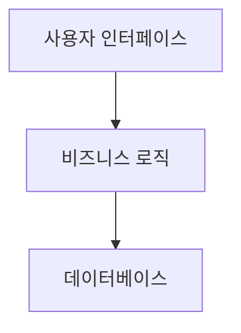
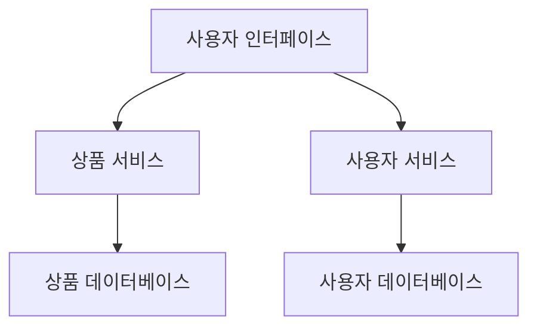

## **1. 모놀리식 아키텍처 (Monolithic Architecture)**

### **정의와 동작 방식**

- 모놀리식 아키텍처는 애플리케이션의 모든 기능(사용자 인터페이스, 비즈니스 로직, 데이터 처리 등)이 **하나의 코드베이스**에 포함되어 동작하는 구조입니다.
- **동작 예시**:
    1. 사용자가 상품을 검색.
    2. 서버가 요청을 받아 비즈니스 로직에서 처리.
    3. 데이터베이스에서 데이터를 조회.
    4. 결과를 사용자에게 반환.

### **구조**

---

### **모놀리식 아키텍처의 장단점**

### **장점**

1. **간단한 개발과 배포**:
    - 모든 기능이 하나의 코드베이스에 있어 개발과 배포가 단순합니다.
2. **성능 최적화 가능**:
    - 데이터 접근과 내부 호출이 동일한 애플리케이션 안에서 이루어져 효율적입니다.
3. **디버깅 용이**:
    - 문제가 발생했을 때 디버깅 범위가 코드베이스 하나로 한정됩니다.

---

### **단점**

1. **확장성 부족**:
    - 서버가 증가해도 트래픽이 특정 부분에서 병목 현상을 일으킬 수 있습니다.
2. **유지보수 어려움**:
    - 코드베이스가 커질수록 수정 시 부작용이 발생할 가능성이 높습니다.
3. **배포의 비효율성**:
    - 작은 수정에도 애플리케이션 전체를 다시 빌드하고 배포해야 합니다.

| 장점 | 단점 |
| --- | --- |
| 설계가 단순함 | 기능 추가/수정 시 리스크 큼 |
| 통합된 코드베이스로 관리 용이 | 배포 시 전체 재배포 필요 |
| 성능 최적화가 상대적으로 쉬움 | 확장성(Scalability) 제한적 |

---

## **2. 마이크로서비스 아키텍처 (MSA)**

### **정의와 동작 방식**

- MSA는 애플리케이션을 여러 개의 독립적인 서비스로 나누어 각각 배포 및 확장할 수 있는 구조입니다.
- **동작 예시**:
    1. 사용자가 상품을 검색.
    2. 상품 검색 서비스가 요청을 받아 처리.
    3. 필요한 경우 다른 서비스(API 호출)를 통해 추가 정보를 가져옴.
    4. 결과를 사용자에게 반환.

### **구조**

---

### **마이크로서비스 아키텍처의 장단점**

### **장점**

1. **독립적 배포**:
    - 특정 기능만 수정하여 배포 가능.
2. **확장성 우수**:
    - 필요한 서비스만 수평 확장 가능 (e.g., 상품 서비스만 서버 추가).
3. **기술 선택의 자유**:
    - 각 서비스에 적합한 기술 스택을 선택할 수 있음.

---

### **단점**

1. **복잡한 설계**:
    - 서비스 간 통신을 고려한 설계가 필요.
2. **운영 비용 증가**:
    - 각 서비스가 별도로 실행되기 때문에 리소스 요구량이 늘어남.
3. **분산 시스템 문제**:
    - 네트워크 지연, 데이터 일관성 문제 발생 가능.

| 장점 | 단점 |
| --- | --- |
| 독립적으로 배포 및 확장 가능 | 설계와 관리 복잡도 증가 |
| 기술 선택의 유연성 | 서비스 간 통신 비용 증가 |
| 장애 격리로 전체 서비스 중단 방지 가능 | 분산 환경에서 디버깅이 어려움 |

---

## **3. 모놀리식과 MSA 비교**

| **항목** | **모놀리식 아키텍처** | **MSA** |
| --- | --- | --- |
| **구조** | 하나의 단일 코드베이스 | 독립된 여러 서비스 |
| **확장성** | 전체 애플리케이션 확장 필요 | 필요한 서비스만 선택적 확장 가능 |
| **배포 방식** | 전체 재배포 필요 | 서비스별 독립적 배포 가능 |
| **기술 선택** | 단일 기술 스택 사용 | 서비스별 다른 기술 사용 가능 |
| **복잡도** | 낮음 | 높음 |

---

## **4. 설계 단계별 가이드**

### **4.1 모놀리식 설계**

1. **계층형 아키텍처 사용**:
    - 사용자 인터페이스, 비즈니스 로직, 데이터 접근 계층을 구분.
    - 각 계층이 명확히 역할을 나누도록 설계.
2. **모듈화**:
    - 기능별로 클래스를 구분하여 코드베이스 관리.
    - 예: `UserController`, `ProductController` 등.

---

### **4.2 MSA 설계**

1. **도메인 분석**:
    - 애플리케이션을 비즈니스 도메인으로 나누어 서비스 정의.
    - 예: 사용자 관리, 상품 관리, 주문 관리 서비스.
2. **API 설계**:
    - 서비스 간 데이터 교환을 위해 REST API 또는 gRPC 설계.
    - 예: `/users`, `/products` 엔드포인트 설계.
3. **데이터 분리**:
    - 서비스별 독립된 데이터베이스 사용.
    - 사용자 서비스는 사용자 데이터베이스, 상품 서비스는 상품 데이터베이스 관리.
4. **서비스 통신**:
    - 동기 방식: REST API.
    - 비동기 방식: 메시지 큐(Kafka, RabbitMQ).

---

## **5. 실습**

### **5.1 모놀리식 애플리케이션 개발**

- **예제**: 블로그 애플리케이션
    1. 사용자 관리 (로그인/회원가입).
    2. 게시물 CRUD.
    3. 댓글 관리.

### **5.2 MSA로 전환**

- **서비스 분리**:
    - 사용자 서비스: 로그인/회원가입 처리.
    - 게시물 서비스: 게시물 CRUD 처리.
    - 댓글 서비스: 댓글 CRUD 처리.
- **기술 사용**:
    - Spring Boot, Spring Cloud, Eureka(서비스 디스커버리).
    - 데이터베이스는 MySQL 또는 MariaDB.

---

## **6. MSA 마이그레이션 전략**

1. **모놀리식 코드 분석**:
    - 기능별로 코드를 나누어 도메인을 정의.
2. **단계적 분리**:
    - 가장 독립적인 기능(예: 사용자 관리)부터 분리.
3. **API 게이트웨이 도입**:
    - 클라이언트 요청을 서비스별로 라우팅.

---

참고

- [넷플릭스 사례로 보는 '마이크로 서비스vs레거.. : 네이버블로그](https://blog.naver.com/c-platform/222693128572)
- [모놀리식과 마이크로서비스 비교 - 소프트웨어 개발 아키텍처의 차이 - AWS](https://aws.amazon.com/ko/compare/the-difference-between-monolithic-and-microservices-architecture/)