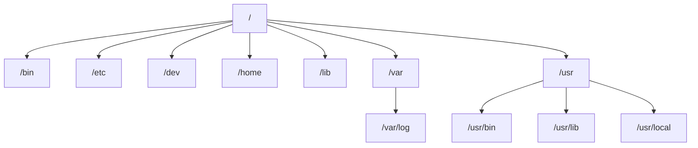

리눅스의 디렉토리 계층 구조는 FHS(Filesystem Hierarchy Standard)에 따라 설계되었습니다. 이 표준은 리눅스 및 유닉스 계열 시스템에서 파일과 디렉토리가 어떻게 구성되고 배치되어야 하는지를 정의합니다. 이를 통해 사용자는 디렉토리의 역할과 파일의 위치를 쉽게 이해할 수 있습니다.

---

### 리눅스 디렉토리 계층 구조의 핵심

리눅스 파일 시스템은 루트 디렉토리(`/`)에서 시작하며, 모든 디렉토리와 파일은 이곳에서 파생됩니다. 루트 디렉토리 아래에는 기능별로 나뉜 하위 디렉토리가 존재합니다.

---

### 주요 디렉토리와 역할

| **디렉토리** | **설명** |
| --- | --- |
| `/` | **루트 디렉토리**: 모든 파일과 디렉토리의 최상위 디렉토리입니다. |
| `/bin` | **사용자 명령어 바이너리**: 시스템 실행에 필요한 기본 명령어(`ls`, `cp`, `mv` 등)가 포함됨. |
| `/boot` | **부팅 파일**: 커널 이미지와 부팅 관련 파일(`vmlinuz`, `initrd` 등)을 포함. |
| `/dev` | **장치 파일**: 하드웨어 장치(CPU, 디스크, USB 등)에 접근하기 위한 가상 장치 파일이 위치. |
| `/etc` | **설정 파일**: 시스템 및 애플리케이션 설정 파일이 저장되는 디렉토리. |
| `/home` | **사용자 홈 디렉토리**: 일반 사용자들의 개인 파일 및 설정이 저장되는 공간. (`/home/username`) |
| `/lib` | **공유 라이브러리**: 실행 파일이 사용하는 필수 라이브러리와 커널 모듈이 위치. |
| `/media` | **외부 장치 마운트 포인트**: CD-ROM, USB 드라이브와 같은 외부 장치가 마운트되는 곳. |
| `/mnt` | **임시 마운트 포인트**: 관리자가 임시로 디스크를 마운트하는 용도로 사용. |
| `/opt` | **추가 소프트웨어**: 선택적 소프트웨어 패키지(사용자 정의 애플리케이션)가 설치되는 공간. |
| `/proc` | **프로세스 정보**: 실행 중인 프로세스에 대한 정보를 가상 파일로 제공하는 디렉토리. |
| `/root` | **루트 사용자 홈 디렉토리**: 시스템 관리자인 `root` 사용자의 홈 디렉토리. |
| `/sbin` | **시스템 바이너리**: 관리자용 시스템 관리 명령어(`reboot`, `ifconfig` 등)가 포함됨. |
| `/srv` | **서비스 데이터**: 서버에서 제공하는 서비스의 데이터가 저장되는 공간(웹 서버 등). |
| `/sys` | **시스템 정보**: 커널과 하드웨어 장치의 상태 정보를 제공하는 가상 파일 시스템. |
| `/tmp` | **임시 파일**: 애플리케이션이 생성하는 임시 파일이 저장되는 디렉토리. 부팅 시 대부분 삭제됨. |
| `/usr` | **사용자 응용 프로그램**: 사용자 공간의 명령어와 라이브러리가 포함됨. 하위 디렉토리로 구성. |
| `/usr/bin` | 사용자용 명령어 바이너리. |
| `/usr/lib` | 응용 프로그램이 사용하는 라이브러리 파일. |
| `/usr/local` | 사용자가 직접 설치한 소프트웨어와 파일. |
| `/var` | **가변 데이터**: 로그 파일, 메일 큐, 데이터베이스 파일 등이 저장됨. |

---

### 디렉토리 간 관계 및 사용 흐름

리눅스 시스템에서 디렉토리는 각자의 역할을 명확히 하여 운영 체제와 사용자 간 효율적인 작업 흐름을 만듭니다.

- **시스템 실행 필수 파일**은 `/bin`, `/sbin`, `/lib` 등에 저장됩니다.
- **사용자 데이터**는 `/home`에 저장됩니다.
- **시스템 설정**은 `/etc`에서 관리됩니다.
- **로그 파일**은 `/var/log`에서 확인할 수 있습니다.

---

---

### 멘탈모델 형성을 위한 비유

리눅스 디렉토리 구조를 **도서관**에 비유해 보겠습니다:

- `/`는 **도서관 전체 건물**입니다.
- `/bin`은 기본적인 도구들(사전, 필기구)을 보관하는 곳.
- `/etc`는 **운영 규칙과 지침서**를 보관하는 곳.
- `/home`은 **사용자의 개인 서재**.
- `/var`는 **임시 메모장과 기록실(로그)**.

---

### 활용 사례

1. **시스템 설정 파일 수정**: `/etc/hosts` 파일을 편집하여 로컬 호스트 이름을 설정.
2. **로그 확인**: `/var/log/syslog`에서 시스템 로그를 점검.
3. **소프트웨어 설치**: `/usr/local`에 직접 소프트웨어를 설치하여 시스템 파일과 분리.
